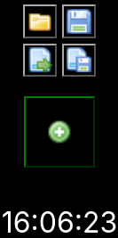
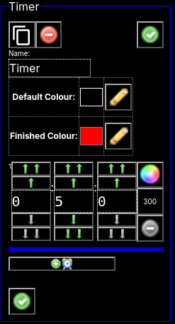
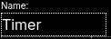
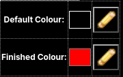
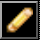
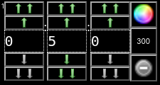
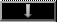
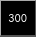
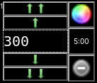
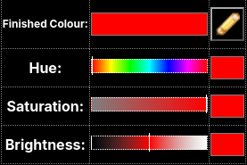

# Timers App

This application is published to [Timers](https://spidererrol.github.io/timers/).

Currently there is only a dark mode colour scheme.

## Main Page

Initially there will only be the main controls and a real-time clock:

.

These consist of:

*  Load a saved set of timers (from current browser storage)
*  Save the current timers (to current browser storage)
*  Upload timers & settings from an external JSON file.
*  Download timers & settings as a JSON file.
*  Add a new timer.

Once you add a timer, it will appear in the last position in edit mode.

## Timers

### Edit

This is composed of the following elements:

*  Clone this timer and it's current state to a new timer.
*  Delete this timer. An autosave will be created just before this timer is deleted.
*  Accept all changes and switch this timer to "Run" mode. There are 2 of these buttons, they both do the same thing.
*  Change the name of the timer here. There are no restrictions imposed here, even duplicate names are permitted.
*  Display the default background colour and the background colour from finished timers along with corrisponding Edit buttons.
*  Edit the corrisponding colour.
*  This is where you can edit a timer stage in Hours:Minutes:Seconds format.
  *  At the top left there is a tiny stage number.
  *  Increment the corrisponding number by 10 or 1. If gray, it would move above maximum.
  *  Decrement the corrisponding number by 10 or 1. If gray, it would move below the minimum.
  *  This button will switch to editing the colour transitions for this stage.
  *  This shows the current stage length in seconds, pressing it will switch to editing in seconds:
    * 
    *  Return to Hours:Minutes:Seconds editing. Also show current (Hours:)Mins:Secs form.
  *  This button will remove this stage. If gray it is disabled. You must have at least one stage.
*  This button will add another stage to this timer.

### Edit default/finished colours

The sliders' backgrounds will alter to reflect the current values of each other.
Clicking the colour swatch next to the slider will switch that slider to direct numeric editing.

Click the  to close the edit sliders.

## TODO (docs)

* Stage colour transitions view.
* Run view.
  * Play
  * Pause
  * Stop
  * Alarm active.
* Minimised view.
* Drag & drop ordering.

## TODO (code)

See [TODO.md](TODO.md)

## END OF FILE
